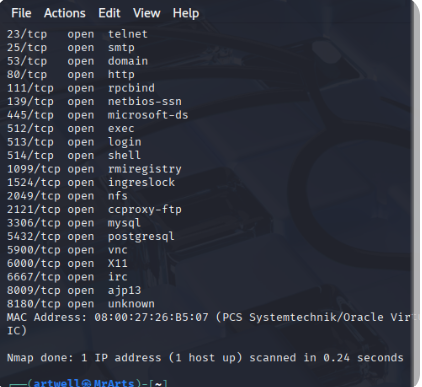
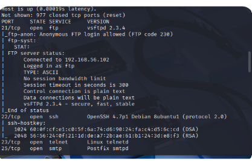
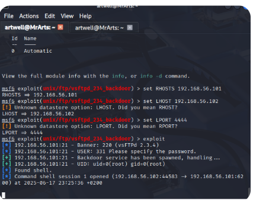
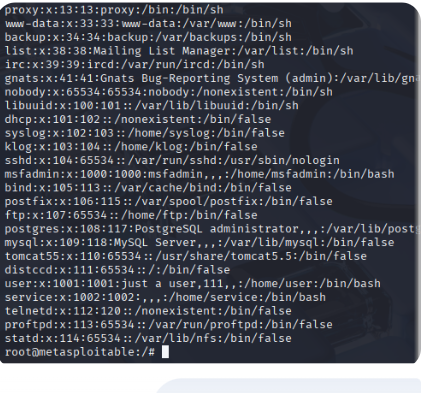

Project Title: Metasploitable2 Vulnerability Assessment & Exploitation
1. Project Overview / Summary
This project involved setting up a controlled cybersecurity lab environment to perform a basic vulnerability assessment and subsequent exploitation of a known vulnerable virtual machine (Metasploitable2) using Kali Linux and the Metasploit Framework.

Key Skills Demonstrated:
Network reconnaissance

Vulnerability scanning

Exploit research and selection

Remote code execution (RCE)

Basic Linux command-line interaction and post-exploitation exploration

Virtual machine management (setup, networking, resource optimization)

Ethical hacking principles and safe lab practices

2. Tools Used
Virtualization Software: Oracle VirtualBox

Attacker Machine: Kali Linux VM

Target Machine: Metasploitable2 VM

Core Cybersecurity Tools:

Nmap: For network discovery and vulnerability scanning.

Metasploit Framework (msfconsole): For exploit research, configuration, and execution.

Linux CLI: For interacting with both Kali Linux and the exploited Metasploitable2 system.

Wireshark (Optional): For deeper network traffic analysis (to be explored in future project phases).

3. Project Steps & Methodology
This section details the methodical approach taken to identify and exploit a vulnerability on the Metasploitable2 target.

3.1. Lab Setup
Initially, Kali Linux was installed in a minimal (command-line only) configuration. This required configuring network connectivity via /etc/network/interfaces and ifup eth0 to establish internet access for updates and tool installation. Subsequently, the XFCE graphical desktop environment was installed via sudo apt install kali-desktop-xfce -y.

The Metasploitable2 vulnerable VM was then imported into VirtualBox by attaching its .vmdk hard disk to a newly created Ubuntu (64-bit) VM instance.

Crucially, both the Kali Linux VM and the Metasploitable2 VM were configured to use a Host-Only Network Adapter in VirtualBox. This ensured they could communicate with each other on an isolated private network (e.g., 192.168.56.x), preventing any unintended impact on the host machine's network or external systems, emphasizing safe and ethical practice. The previously installed Rocky Linux VM was removed to optimize host system resources.

3.2. Reconnaissance & Vulnerability Scanning (Nmap)
With the lab environment established, Nmap was used from the Kali Linux VM to perform reconnaissance on the Metasploitable2 target (IP: 192.168.56.101).

A comprehensive Nmap scan (nmap -sV -sC -p- 192.168.56.101) was executed to identify all open ports, the services running on them, their respective versions, and to run default Nmap scripts for additional insights.

Specific Finding: The scan revealed vsftpd 2.3.4 running on TCP port 21. This specific version is widely known to contain a severe backdoor vulnerability, making it a prime target for exploitation. Other open services such as Telnet, SSH, HTTP, Samba, and various database services were also identified, indicating multiple potential attack vectors.

3.3. Exploit Research & Selection (Metasploit Framework)
Following the Nmap findings, the Metasploit Framework console (msfconsole) was launched in Kali Linux to research available exploits.

A search within Metasploit for vsftpd 2.3.4 quickly yielded the exploit/unix/ftp/vsftpd_234_backdoor module, which directly targets the identified vulnerability.

3.4. Exploitation (Metasploit)
The selected Metasploit module was configured and executed to gain access to the Metasploitable2 system.

The RHOSTS option was set to the target's IP address (192.168.56.101).

The LHOST option was set to the Kali Linux VM's IP address on the Host-Only network (192.168.56.102), for the reverse shell to connect back to.

A LPORT (4444) was chosen for the listener on the Kali machine.

The exploit command was then executed.

Key Outcome: The exploit successfully leveraged the vsftpd 2.3.4 backdoor, leading to the establishment of a command shell with root privileges (UID: uid=0(root) gid=0(root)) on the Metasploitable2 target.

3.5. Post-Exploitation (Basic Shell Interaction)
Upon gaining the initial, basic shell, it was necessary to upgrade it to a fully interactive TTY shell for better usability and command execution.

The command python -c 'import pty; pty.spawn("/bin/bash")' was used to spawn a more stable Bash shell. Subsequent stty raw -echo and export TERM=xterm commands were also applied for full TTY functionality.

Access was verified using whoami, which successfully returned root.

Basic exploration commands were executed, such as ls -la to list files and directories, and cat /etc/passwd to enumerate user accounts on the compromised system. This confirmed full control and the ability to interact deeply with the target.

4. Key Learnings & Takeaways
This mini-project provided invaluable hands-on experience in the initial phases of penetration testing within a secure virtual lab environment.

Practical Application: Successfully applied theoretical knowledge of networking and vulnerabilities (e.g., vsftpd backdoor) in a controlled, simulated real-world scenario.

Understanding the Kill Chain: Gained practical insight into the typical stages of a penetration test, progressing from reconnaissance (Nmap) to vulnerability analysis, exploitation (Metasploit), and basic post-exploitation actions.

Importance of Lab Environments: Highlighted the critical value of isolated virtual lab setups for ethical learning and experimentation, ensuring no harm to external systems.

Problem-Solving & Persistence: Demonstrated problem-solving skills by troubleshooting initial Kali Linux setup challenges (minimal install, network configuration issues) and overcoming basic shell limitations during post-exploitation.

Foundational Skills: Solidified understanding of essential Linux command-line operations and their application in cybersecurity contexts.

Next Steps: Future iterations will involve exploring other vulnerabilities on Metasploitable2 (e.g., web application flaws using Burp Suite or specific Samba exploits), practicing privilege escalation techniques from non-root accounts, and learning about data exfiltration and persistence.

5. Supporting Evidence
(Please insert your actual screenshot image files here, using Markdown image syntax, after you have uploaded them to the screenshots/ folder in your repository.)

Screenshot 1: Nmap Scan Results

Caption: Initial Nmap scan results identifying open ports, services, and the critical vsftpd 2.3.4 version.

Screenshot 2: Metasploit Exploit Session

Caption: Metasploit console showing exploit setup (RHOSTS, LHOST, LPORT), successful backdoor execution, and gaining root UID/GID.

Screenshot 3: Root Shell Interaction

Caption: Confirmation of root access using whoami returning root after stabilizing the shell connection on Metasploitable2.

Screenshot 4: Post-Exploitation Data

