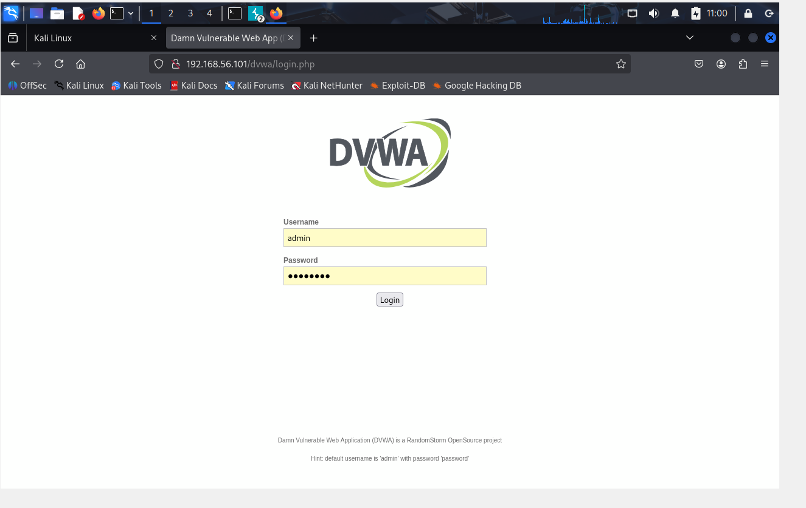
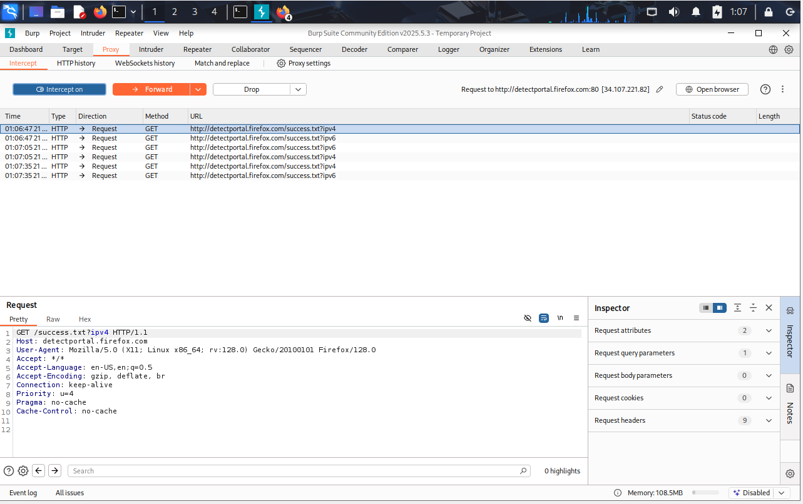
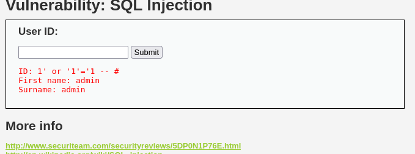
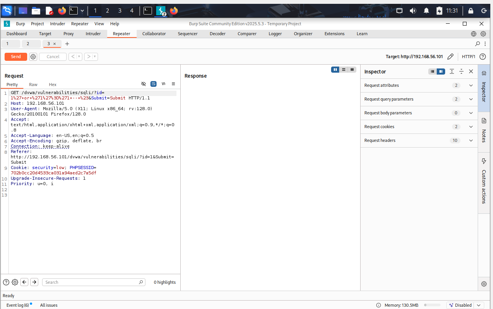
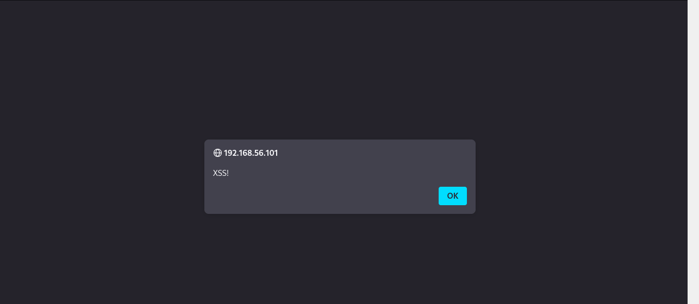

Project Title: Web Application Penetration Testing Basics
1. Project Overview / Summary
This project focused on the foundational aspects of web application security testing. It involved setting up a controlled lab environment to identify and exploit common web vulnerabilities, specifically SQL Injection and Cross-Site Scripting (XSS), using Kali Linux, Metasploitable2, and the essential web proxy tool, Burp Suite.

Key Skills Demonstrated:
Web application reconnaissance (identifying vulnerable web services).

Understanding and configuring a web proxy for traffic interception and manipulation.

Analyzing HTTP requests and responses.

Identifying and exploiting SQL Injection to retrieve sensitive database information.

Identifying and exploiting Cross-Site Scripting (XSS) to demonstrate client-side code execution.

Proficient use of Burp Suite Community Edition for web traffic analysis and vulnerability testing.

Adherence to ethical hacking principles within an isolated lab environment.

2. Tools Used
Virtualization Software: Oracle VirtualBox

Attacker Machine: Kali Linux VM

Target Machine: Metasploitable2 VM (hosting vulnerable web applications)

Core Cybersecurity Tools:

Kali Linux Web Browser: (e.g., Firefox/Chromium) for interacting with web applications.

Burp Suite Community Edition: An integrated platform for performing security testing of web applications. Used for proxying, intercepting, modifying, and analyzing web traffic.

3. Project Steps & Methodology
This section details the methodical approach taken to identify and exploit web application vulnerabilities on the Metasploitable2 target.

3.1. Lab Setup & DVWA Configuration
VM Setup: Ensured both Kali Linux VM (with internet access via NAT and Host-Only network for target communication) and Metasploitable2 VM (on Host-Only network) were powered on and communicating.

Access DVWA: From the Kali Linux VM, navigated to Metasploitable2's web interface (http://192.168.56.101/) using Firefox.

DVWA Login: Accessed the DVWA (Damn Vulnerable Web Application) link and logged in with default credentials (admin/password).

Security Level Configuration: Navigated to "DVWA Security" and set the security level to "low" to facilitate learning and exploitation of basic vulnerabilities.

3.2. Introducing and Configuring Burp Suite
Launch Burp Suite: Started Burp Suite Community Edition from Kali's "Web Application Analysis" menu, accepting default temporary project settings. Confirmed "Proxy" tab and "Intercept" sub-tab were active with "Intercept is on".

Browser Proxy Configuration: Configured Firefox's network proxy settings to manually use Burp Suite as a proxy:

HTTP Proxy: 127.0.0.1

Port: 8080

Checked "Also use this proxy for HTTPS".

Proxy Test: Refreshed the browser to confirm Burp Suite intercepted requests (e.g., Firefox's portal detection). Forwarded requests to allow browsing to proceed, verifying proper proxy functionality.

3.3. Exploiting SQL Injection (DVWA - Low Security)
Navigation: In the proxied browser, navigated to DVWA's "SQL Injection" section.

Basic Valid Test: Entered 1 into the "User ID" field and submitted to observe normal application behavior (displaying user ID 1).

SQL Injection Payload Execution: Entered the SQL Injection payload 1' or '1'='1 -- # into the "User ID" field and clicked "Submit".

Observed Outcome: The web application returned results for all users in the database, specifically showing "admin" details, confirming that the injected SQL query was executed successfully, bypassing authentication/logic.

Burp Repeater Experimentation: Sent the successful SQL Injection request from Burp's "HTTP history" to the "Repeater" tab. Used Repeater to modify the id parameter (e.g., changing it back to id=1) and re-send requests, observing the changing server responses without browser interaction, demonstrating manual request manipulation.

3.4. Exploiting Cross-Site Scripting (XSS - Reflected, DVWA - Low Security)
Navigation: In the proxied browser, navigated to DVWA's "XSS (Reflected)" section.

Basic Valid Test: Entered a simple name (YourName) into the "Name" field and submitted to observe normal reflection of the input.

XSS Payload Execution: Entered the XSS payload  into the "Name" field and clicked "Submit".

Observed Outcome: A JavaScript alert box immediately popped up in the browser with the message "XSS!", confirming that the web application failed to sanitize the input, allowing arbitrary client-side script execution.

Burp Suite Analysis (HTTP History/Repeater): Reviewed the request in Burp's "HTTP history" and noted how the payload was reflected in the server's response HTML, demonstrating the vulnerability.

4. Key Learnings & Takeaways
This project provided crucial hands-on experience in the practical application of web application penetration testing methodologies.

HTTP Protocol Mastery: Gained a deeper understanding of HTTP requests (GET, POST) and responses, headers, and parameters through Burp Suite's interception capabilities.

Web Proxy Proficiency: Became proficient in configuring and utilizing Burp Suite as an essential tool for intercepting, analyzing, and modifying web traffic, which is fundamental for web security assessments.

Vulnerability Recognition: Learned to recognize the tell-tale signs of common web vulnerabilities like SQL Injection (e.g., unexpected database errors, returning all records) and XSS (e.g., script execution).

Payload Construction: Practiced crafting and adjusting payloads for SQL Injection and XSS, understanding how they interact with server-side logic and client-side rendering.

Ethical Hacking Practice: Reinforced the importance of operating within controlled, isolated lab environments to conduct ethical testing and prevent unintended harm.

Foundational for Advanced Testing: Built a strong foundation for exploring more advanced web vulnerabilities, bypass techniques (for higher security levels in DVWA), and other Burp Suite features (like Intruder, Scanner, Decoder).

5. Supporting Evidence
(Please insert your actual screenshot image files here, using Markdown image syntax, after you have uploaded them to a screenshots/ folder within this project's directory in your GitHub repository.)

Screenshot 1: DVWA Login & Security Setup

Caption: DVWA login page and confirmation of security level set to 'low'.

Screenshot 2: Burp Suite Proxy Configuration

Caption: Browser proxy settings configured to send traffic through Burp Suite on 127.0.0.1:8080.

Screenshot 3: Burp Suite Intercepting Traffic

Caption: Burp Suite's Proxy tab showing intercepted HTTP requests, confirming the proxy is active.

Screenshot 4: Successful SQL Injection Result

Caption: Browser output showing all users (e.g., 'admin') after injecting '1' or '1'='1 -- #' into the User ID field.

Screenshot 5: SQLi Request in Burp Repeater

Caption: The SQL Injection request captured in Burp Repeater, ready for modification and re-sending.

Screenshot 6: Successful XSS Alert

Caption: Browser displaying a JavaScript alert box ('XSS!') after injecting  into the 'Name' field.

